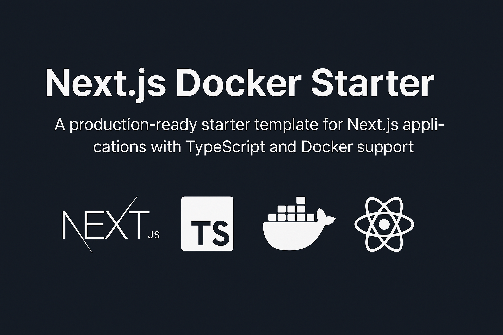

# Next.js Docker Starter

A production-ready starter template for Next.js applications with TypeScript and Docker support.



## Tech Stack

- Next.js 15
- TypeScript
- Docker
- React 18

## Project Structure

```
nextjs-dockerise/
├── app/                    # Next.js 15 app directory
├── public/                 # Static files
├── components/             # React components
├── Dockerfile.dev         # Development Docker configuration
├── Dockerfile        # Production Docker configuration
├── docker-compose.yml     # Docker compose configuration
└── package.json          # Project dependencies
```

## Development Setup

1. Clone the repository:

```bash
git clone https://github.com/sumoncse19/nextjs-docker-starter.git
cd nextjs-docker-starter
```

2. Install dependencies:

```bash
pnpm install   # or yarn install, npm install
```

3. Development with Docker:

```bash
# Start development server with hot-reload
docker-compose up dev

# Stop containers
docker-compose down
```

4. Development without Docker:

```bash
pnpm dev   # or yarn dev, npm run dev
```

## Production Deployment

1. Build the production Docker image:

```bash
docker build -f Dockerfile -t nextjs-app-prod .
```

2. Run the production container:

```bash
docker run -p 3000:3000 nextjs-app-prod
```

## Docker Commands

```bash
# Remove all containers
docker rm -f $(docker ps -aq)

# Remove all images
docker rmi -f $(docker images -q)

# Clean up system
docker system prune -a

# View logs
docker-compose logs -f
```

## Environment Variables

Create a `.env.local` file in the root directory:

```env
NEXT_PUBLIC_API_URL=your_api_url
```

## Available Scripts

```bash
# Development
pnpm dev          # Start development server
pnpm build        # Build production application
pnpm start        # Start production server
pnpm lint         # Run ESLint
pnpm type-check   # Run TypeScript compiler check

# Docker Development
docker-compose up dev      # Start development environment
docker-compose up prod     # Start production environment
docker-compose down        # Stop containers
```

## Best Practices

- Use TypeScript for type safety
- Follow ESLint and Prettier configurations
- Write unit tests for components
- Use environment variables for configuration
- Follow Git branching strategy:
  - main: production-ready code
  - develop: development branch
  - feature/\*: new features
  - hotfix/\*: urgent fixes

## Common Issues

1. Port already in use:

```bash
docker-compose down
# or
kill $(lsof -t -i:3000)
```

2. Docker cache issues:

```bash
docker-compose build --no-cache
```

## Contributing

1. Fork the repository
2. Create your feature branch: `git checkout -b feature/your-feature`
3. Commit changes: `git commit -m 'Add some feature'`
4. Push to branch: `git push origin feature/your-feature`
5. Submit a pull request

## License

MIT License - feel free to use this project for your own purposes.
